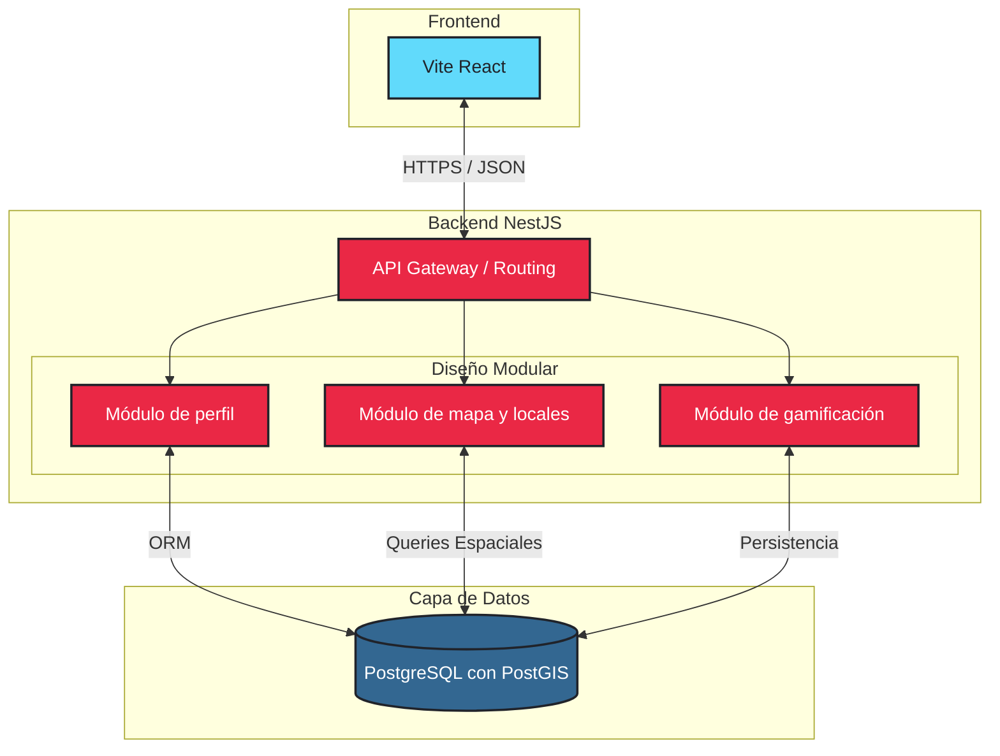

# Arquitectura del software

## Justificación del modelo

### Decisión Arquitectónica: Monolito Modular de Tres Capas

Elegimos un modelo de tres capas (Frontend, Backend y Datos) con un backend estructurado como monolito modular. Esta decisión se fundamenta en los requisitos extrafuncionales priorizados:

#### Escalabilidad (Requisito de Prioridad Alta)
El sistema debe soportar hasta 10,000 usuarios concurrentes y permitir migración futura a microservicios. La arquitectura modular proporciona los límites claros necesarios para esta transición gradual. Cada módulo (Perfil, Mapa, Gamificación) mantiene responsabilidades independientes, facilitando su extracción a servicios separados conforme crezca la demanda.

#### Rendimiento / Eficiencia (Requisito de Prioridad Alta)
El mapa debe cargar marcadores en menos de 3 segundos. Utilizamos PostgreSQL con PostGIS para realizar queries espaciales optimizadas directamente en la base de datos, evitando transferencias innecesarias de datos.

#### Disponibilidad (Requisito de Prioridad Alta)
La aplicación debe estar disponible el 99.5% del tiempo con recuperación automática de errores. La separación clara de módulos permite aislar fallos: si el módulo de gamificación experimenta problemas, el mapa y perfil continúan operacionales.

#### Seguridad (Requisito de Prioridad Media)
La arquitectura centralizada en un API Gateway permite implementar autenticación, autorización basada en roles y validación/sanitización de entradas en un único punto de entrada. El módulo de Perfil gestiona la identidad de forma centralizada, garantizando integridad de credenciales.

#### Mantenibilidad (Requisito de Prioridad Baja)
Una arquitectura monolítica modular mantiene separación clara entre módulos, facilitando su comprensión, modificación y documentación. Evita la complejidad operacional de microservicios mientras preserva cohesión en el código.

### Definición de Módulos

---

#### Módulo de Perfil

##### Responsabilidad:
- Gestión centralizada de la identidad y autenticación del usuario.
- Control de acceso basado en roles (USUARIO con PERFIL que tiene ROL específico).
- Mantenimiento de la integridad de datos de usuario y seguridad de credenciales.

##### Datos que maneja:
- USUARIO: id, email, contraseña, nombre, fecha_registro, estado activo
- PERFIL: id, rol, biografia, ubicación, foto
- RED_SOCIAL: hooks con Instagram, Spotify, YouTube, SoundCloud, Twitter, Facebook etc
- PORTAFOLIO: eventos participados, géneros tocados, historial de shows (específico para Músicos)
- Preferencias de usuario: géneros_preferidos, filtros guardados, notificaciones

##### Interacción con otros módulos:
- **Con Mapa**: Proporciona información de usuario para filtrar eventos según sus preferencias. Recibe actualizaciones de confirmación de asistencia a eventos.
- **Con Gamificación**: Notifica eventos de usuario (registro, confirmación, reseña) para asignación de puntos. Recibe datos de XP, nivel actual y ranking para mostrar en perfil.

---

#### Módulo de Mapa

##### Responsabilidad:
- Gestión completa del ciclo de vida de puntos de interés (CRUD: Create, Read, Update, Delete).
- Validación de coordenadas geoespaciales usando PostGIS.
- Procesamiento de queries espaciales: distancia, proximidad, área de influencia.
- Filtrado y búsqueda avanzada de locales según múltiples criterios.
- Verificación de puntos sugeridos por comunidad vs. verificados por dueños.

##### Datos que maneja:
- PUNTO_INTERES: id, nombre, descripción, latitud, longitud, dirección, teléfono, capacidad, tipo (Bar, Sala, Plaza, Centro Cultural, etc.)
- CATEGORIA: clasificación de tipos de espacios
- HORARIO: días de semana, horas apertura/cierre, indicador de música en vivo por día
- EVENTO: fecha, hora, género, artistas, precio, capacidad, confirmación por dueño
- VERIFICACION: estado de verificación (Pendiente, Verificado, Rechazado), documentos adjuntos
- RESENA: calificaciones 1-5, comentarios, estado de verificación por asistencia
- ASISTENCIA: confirmaciones de usuarios a eventos, historial

##### Interacción con otros módulos:
- **Con Perfil**: Recibe datos de usuario (preferencias, rol) para filtrar resultados. Consulta información de artistas/dueños.
- **Con Gamificación**: Emite eventos: confirmar_asistencia, crear_evento_verificado, escribir_reseña, validar_informacion. Recibe datos de ranking para mostrar credibilidad de usuarios.

---

#### Módulo de Gamificación

##### Responsabilidad:
- Cálculo y asignación de puntos de experiencia (XP) basados en acciones específicas.
- Gestión de progresión de niveles.
- Administración de logros y insignias desbloquead por hitos.
- Cálculo de rankings globales, por rol y por ciudad geográfica.
- Retención de usuarios mediante motivación gamificada.

##### Datos que maneja:
- PUNTOS: id, id_usuario, tipo_accion, puntos_ganados, fecha
- LOGRO: id, id_usuario, tipo, nombre, descripción, icono, fecha_obtencion, oculto
- RANKING: id_usuario, posicion_global, posicion_por_rol, posicion_por_ciudad, puntos_totales
- GAMIFICACION: id_usuario, puntos_xp_total, nivel_actual, racha_dias_consecutivos

##### Tabla de puntos por acción:
- Registrar nuevo lugar: 50 XP
- Confirmar asistencia evento: 10 XP
- Escribir reseña: 25 XP
- Crear evento verificado: 75 XP
- Validar información de lugar: 15 XP
- Racha 7 días consecutivos: 100 XP bono

##### Interacción con otros módulos:
- **Escucha eventos de Mapa**: Cuando usuario confirma asistencia, escribe reseña, crea evento, etc. Automáticamente calcula y asigna XP.
- **Consultas desde Perfil**: Envía datos de XP, nivel, logros y ranking para mostrar en perfil de usuario.
- **Notificaciones**: Emite eventos cuando usuario sube de nivel o desbloquea logro para notificar en tiempo real.

---