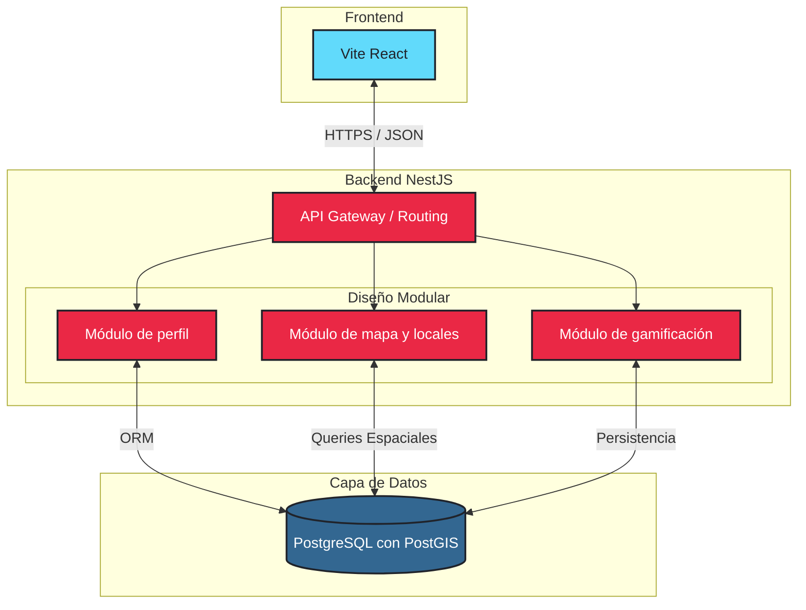

# Arquitectura del software

## Justificación del modelo
Elegimos un modelo de tres capas (frontend, backend y datos) con un backend estructurado como monolito modular.
Esta decisión reduce significativamente la complejidad operativa inicial frente
a una arquitectura de microservicios puros, lo que permite un desarrollo
más ágil para el equipo. Al mismo tiempo, mantiene una estricta separación
de responsabilidades, asegurando que el código sea cohesivo, escalable
y preparado para una futura migración a microservicios si la carga del sistema lo requiere.

### Definición de Módulos

---

#### Módulo de Perfil
##### Responsabilidad:
- Gestión central de la identidad del usuario.
- Roles (músico, público o dueño de local).
- Manejo de la sesión.
##### Datos que maneja:
- Información personal.
- enlaces a redes sociales.
- portafolio musical e historial de shows.
##### Interacción:
Funciona de manera bidireccional. Filtra los eventos del módulo de mapa basándose
en las preferencias del usuario, y se comunica con gamificación para registrar acciones que otorgan experiencia.

---

#### Módulo de Gamificación
##### Responsabilidad:
Motor de incentivos diseñado para administrar el progreso y retener a los usuarios en la plataforma.
##### Datos que maneja:
Frecuencia de actividad, puntos de experiencia (XP), niveles de usuario, historial de insignias obtenidas y ranking entre usuarios.
##### Interacción:
Recibe "eventos de éxito" de otros módulos (como asistir a un local o dejar una reseña) y le ofrece los datos de rango actualizados al módulo de perfil.

---

#### Módulo de Mapa
##### Responsabilidad:
- Gestiona la validación
- Visualización
- Filtrado en mapa de los puntos de encuentro.
##### Datos que maneja:
- Coordenadas en mapa.
- categorías de locales (público/privado, disponibilidad de escenario, música en vivo regular etc)
- detalles de eventos temporales (fecha, género, artista etc).
##### Interacción:
Expone la confirmación de asistencia a eventos y emite notificaciones a los usuarios.

---

### [Ver Figma](https://try-step-50438657.figma.site/)