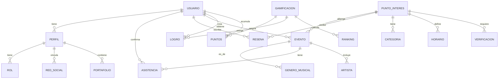

# Modelo de Dominio

## Diagrama de Entidades del Dominio



---

## Entidades Principales

### 1. USUARIO
**Responsabilidad:** Representar a cualquier persona que se registra en la plataforma.

**Atributos:**
- `id_usuario` (PK): Identificador único
- `email` (UNIQUE): Correo electrónico
- `password`: Contraseña encriptada
- `nombre_completo`: Nombre del usuario
- `fecha_registro`: Fecha de creación de cuenta
- `activo`: Estado de la cuenta (boolean)
- `id_perfil` (FK): Referencia al perfil del usuario

**Métodos:**
- `registrar()`
- `iniciar_sesion()`
- `editar_perfil()`
- `cerrar_sesion()`

---

### 2. PERFIL
**Responsabilidad:** Almacenar información específica del usuario según su rol.

**Atributos:**
- `id_perfil` (PK): Identificador único
- `id_usuario` (FK): Referencia al usuario
- `rol` (ENUM): Músico | Público | Dueño | Productor | Entidad_Cultural
- `foto_perfil` (URL): Imagen de perfil
- `bio`: Descripción personal
- `ubicacion`: Ciudad/País
- `fecha_nacimiento`: Fecha de nacimiento
- `generos_preferidos` (JSON Array): Géneros musicales que prefiere
- `experiencia_xp`: Puntos de experiencia acumulados

**Métodos:**
- `actualizar_bio()`
- `cambiar_rol()`
- `vincular_redes_sociales()`

---

### 3. ROL
**Responsabilidad:** Definir los permisos y capacidades de cada tipo de usuario.

**Atributos:**
- `id_rol` (PK): Identificador único
- `nombre` (ENUM): Músico | Público | Dueño | Productor | Entidad_Cultural
- `descripcion`: Descripción del rol
- `permisos` (JSON Array): Lista de permisos disponibles

**Enum de Roles:**
```
MUSICO: Puede buscar locales, confirmar asistencia, dejar reseñas
PUBLICO: Puede buscar y filtrar locales, ver eventos
DUENO: Puede reclamar locales, crear eventos, editar información
PRODUCTOR: Puede consultar artistas, ver históricos, acceder a redes sociales
ENTIDAD_CULTURAL: Puede registrar espacios públicos, publicar eventos
```

---

### 4. RED_SOCIAL
**Responsabilidad:** Vincular perfiles de redes sociales del usuario.

**Atributos:**
- `id_red_social` (PK): Identificador único
- `id_usuario` (FK): Referencia al usuario
- `plataforma` (ENUM): Instagram | Spotify | YouTube | SoundCloud | Twitter | Facebook
- `url_perfil`: URL del perfil en la plataforma
- `verificado`: Si ha sido validado (boolean)
- `fecha_vinculacion`: Cuándo se vinculó

**Métodos:**
- `vincular_red()`
- `desvincular_red()`
- `verificar_red()`

---

### 5. PORTAFOLIO
**Responsabilidad:** Guardar el historial de participaciones de un músico.

**Atributos:**
- `id_portafolio` (PK): Identificador único
- `id_usuario` (FK): Referencia al usuario
- `eventos_participados` (Array): Lista de eventos donde participó
- `generos_tocados` (JSON Array): Géneros en los que ha tocado
- `fecha_ultimo_evento`: Última participación registrada
- `descripcion_artistico`: Descripción de su estilo musical

**Métodos:**
- `agregar_evento_portafolio()`
- `obtener_historial()`
- `generar_perfil_artístico()`

---

### 6. PUNTO_INTERES
**Responsabilidad:** Representar lugares físicos donde se hace música (locales, bares, plazas, etc.).

**Atributos:**
- `id_punto` (PK): Identificador único
- `nombre`: Nombre del lugar
- `descripcion`: Descripción general
- `latitud` (GEO): Coordenada de latitud
- `longitud` (GEO): Coordenada de longitud
- `direccion`: Dirección completa
- `telefono`: Teléfono de contacto
- `capacidad`: Cantidad máxima de personas
- `tipo` (ENUM): Bar | Sala de Conciertos | Plaza | Centro Cultural | Estudio
- `creado_por` (FK): Usuario que sugirió/creó el lugar
- `fecha_creacion`: Cuándo se registró
- `verificado`: Si fue verificado por equipo (boolean)

**Métodos:**
- `calcular_distancia_usuario(lat, lon)`
- `obtener_eventos_cercanos()`
- `filtrar_por_genero()`

---

### 7. CATEGORIA
**Responsabilidad:** Clasificar tipos de espacios musicales.

**Atributos:**
- `id_categoria` (PK): Identificador único
- `nombre`: Nombre de la categoría
- `descripcion`: Descripción
- `icono`: Ícono representativo (URL)

**Categorías Predefinidas:**
```
- Bar Musical
- Sala de Conciertos
- Estudio de Ensayo
- Plaza Pública
- Centro Cultural
- Discoteca
- Café con Música Viva
- Galería de Arte
```

---

### 8. HORARIO
**Responsabilidad:** Definir los horarios en que un punto de interés tiene actividad musical.

**Atributos:**
- `id_horario` (PK): Identificador único
- `id_punto` (FK): Referencia al punto de interés
- `dia_semana` (ENUM): Lunes a Domingo
- `hora_apertura` (TIME): Hora en que abre
- `hora_cierre` (TIME): Hora en que cierra
- `tiene_musica_viva`: ¿Hay música en vivo ese día? (boolean)
- `generos_ese_dia` (JSON Array): Géneros musicales que presenta

**Métodos:**
- `esta_abierto_ahora()`
- `proximos_horarios()`

---

### 9. EVENTO
**Responsabilidad:** Representar eventos específicos dentro de un punto de interés.

**Atributos:**
- `id_evento` (PK): Identificador único
- `id_punto` (FK): Referencia al punto de interés
- `id_creador` (FK): Usuario que creó el evento
- `nombre`: Nombre del evento
- `descripcion`: Descripción detallada
- `fecha`: Fecha del evento (DATE)
- `hora_inicio` (TIME): Hora de inicio
- `hora_fin` (TIME): Hora de finalización
- `genero_musical`: Género principal del evento
- `artistas_participantes` (JSON Array): Nombres de artistas
- `entrada_gratuita`: ¿Es gratis? (boolean)
- `precio_entrada`: Costo de entrada (si aplica)
- `capacidad_disponible`: Lugares disponibles
- `poster` (URL): Imagen del evento
- `confirmado`: Si el dueño lo confirmó (boolean)

**Métodos:**
- `confirmar_evento()`
- `actualizar_capacidad()`
- `obtener_asistentes()`
- `cancelar_evento()`

---

### 10. GENERO_MUSICAL
**Responsabilidad:** Definir los géneros musicales disponibles en la plataforma.

**Atributos:**
- `id_genero` (PK): Identificador único
- `nombre`: Nombre del género
- `descripcion`: Descripción
- `icono`: Ícono representativo (URL)
- `color`: Color asociado para UI

**Géneros Predefinidos:**
```
Rock, Pop, Jazz, Blues, Reggae, Hip-Hop, Metal, Clásica, Electrónica, Cumbia, Salsa, Folklore, Indie, Latino, Urbano, etc.
```

---

### 11. ASISTENCIA
**Responsabilidad:** Registrar confirmaciones de asistencia de usuarios a eventos.

**Atributos:**
- `id_asistencia` (PK): Identificador único
- `id_usuario` (FK): Usuario que confirma asistencia
- `id_evento` (FK): Evento al que confirma asistencia
- `fecha_confirmacion` (DATETIME): Cuándo confirmó
- `asistio_realmente` (boolean): Si realmente asistió
- `calificacion`: Puntuación 1-5 (opcional)

**Métodos:**
- `confirmar_asistencia()`
- `cancelar_asistencia()`
- `marcar_como_asistido()`

---

### 12. RESENA
**Responsabilidad:** Almacenar valoraciones y comentarios de usuarios sobre lugares.

**Atributos:**
- `id_resena` (PK): Identificador único
- `id_usuario` (FK): Usuario que escribe la reseña
- `id_punto` (FK): Punto de interés reseñado
- `calificacion` (INT 1-5): Puntuación
- `titulo`: Título de la reseña
- `contenido` (TEXT): Texto de la reseña
- `fecha_creacion` (DATETIME): Cuándo se escribió
- `votos_utiles` (INT): Votos de "útil" que recibió
- `verificado_por_asistencia`: Si el usuario asistió (boolean)

**Métodos:**
- `crear_resena()`
- `editar_resena()`
- `eliminar_resena()`
- `votar_util()`

---

### 13. VERIFICACION
**Responsabilidad:** Registrar el proceso de verificación de puntos de interés.

**Atributos:**
- `id_verificacion` (PK): Identificador único
- `id_punto` (FK): Punto a verificar
- `id_dueño` (FK): Dueño del punto
- `estado` (ENUM): Pendiente | Verificado | Rechazado
- `documentos_adjuntos` (Array): Pruebas de identidad/propiedad
- `fecha_solicitud` (DATETIME): Cuándo se solicitó
- `fecha_resolucion` (DATETIME): Cuándo se resolvió
- `comentarios_admin` (TEXT): Motivo de rechazo (si aplica)

**Métodos:**
- `solicitar_verificacion()`
- `aprobar_verificacion()`
- `rechazar_verificacion()`

---

### 14. GAMIFICACION
**Responsabilidad:** Gestionar el sistema de incentivos (puntos, logros, ranking).

**Atributos:**
- `id_gamificacion` (PK): Identificador único
- `id_usuario` (FK): Usuario participante
- `puntos_xp_total` (INT): Puntos totales acumulados
- `nivel_actual` (INT): Nivel del usuario (1-100)
- `fecha_proximo_nivel` (DATE): Cuándo sube de nivel
- `racha_dias_consecutivos` (INT): Días activo consecutivo

**Métodos:**
- `calcular_proxima_meta()`
- `verificar_upgrade_nivel()`
- `resetear_racha()`

---

### 15. PUNTOS
**Responsabilidad:** Detallar las acciones que otorgan puntos de experiencia.

**Atributos:**
- `id_puntos` (PK): Identificador único
- `id_usuario` (FK): Usuario que gana puntos
- `id_evento` (FK): Evento asociado (opcional)
- `tipo_accion` (ENUM): Registrar_Lugar | Confirmar_Asistencia | Escribir_Resena | Crear_Evento | Validar_Informacion
- `puntos_ganados` (INT): Cantidad de puntos
- `fecha_obtencion` (DATETIME): Cuándo se ganaron
- `descripcion`: Descripción de la acción

**Tabla de Puntos por Acción:**
```
- Registrar un nuevo lugar: 50 XP
- Confirmar asistencia a un evento: 10 XP
- Escribir una reseña: 25 XP
- Crear un evento verificado: 75 XP
- Validar información de un lugar: 15 XP
- Racha de 7 días: 100 XP
- Primer evento: 50 XP
```

---

### 16. LOGRO
**Responsibilidad:** Insignias y logros especiales obtenidos por usuarios.

**Atributos:**
- `id_logro` (PK): Identificador único
- `id_usuario` (FK): Usuario que obtuvo el logro
- `tipo` (ENUM): Novato | Viajero | Crítico | Anfitrión | Estrella | etc.
- `nombre`: Nombre del logro
- `descripcion`: Descripción
- `icono` (URL): Imagen del logro
- `fecha_obtencion` (DATETIME): Cuándo se obtuvo
- `oculto`: ¿Es secreto? (boolean)

**Logros Predefinidos:**
```
- Novato: Registrarse (automático)
- Viajero: Visitar 5 locales diferentes
- Crítico: Escribir 10 reseñas
- Anfitrión: Crear 5 eventos
- Estrella: Alcanzar 1000 XP
- Explorador: Visitar locales en 5 ciudades diferentes
- Músico Activo: Tocar en 20 eventos
```

---

### 17. RANKING
**Responsabilidad:** Posicionamiento global de usuarios en la plataforma.

**Atributos:**
- `id_ranking` (PK): Identificador único
- `id_usuario` (FK): Usuario
- `posicion_global` (INT): Puesto en el ranking
- `posicion_por_rol` (INT): Puesto entre usuarios con su mismo rol
- `posicion_por_ciudad` (INT): Puesto en su ciudad
- `fecha_actualizacion` (DATETIME): Última actualización
- `puntos_totales` (INT): Puntos considerados para el ranking

**Métodos:**
- `calcular_ranking_global()`
- `calcular_ranking_por_rol()`
- `obtener_top_10()`

---

## Relaciones Principales

### 1:N (Uno a Muchos)
- Un **USUARIO** puede escribir muchas **RESENAS**
- Un **USUARIO** puede confirmar asistencia a muchos **EVENTOS** (mediante ASISTENCIA)
- Un **PUNTO_INTERES** puede albergar muchos **EVENTOS**
- Un **PUNTO_INTERES** puede recibir muchas **RESENAS**
- Un **USUARIO** puede obtener muchos **LOGROS**

### N:N (Muchos a Muchos)
- Un **EVENTO** puede incluir muchos **ARTISTAS** (usuarios con rol MUSICO)
- Un **USUARIO** puede tener múltiples **REDES_SOCIALES**
- Un **USUARIO** puede preferir múltiples **GENEROS_MUSICALES**

---

## Restricciones y Validaciones

1. **Email único**: No puede haber dos usuarios con el mismo email
2. **Coordenadas válidas**: Latitud entre -90 y 90, Longitud entre -180 y 180
3. **Calificaciones**: Entre 1 y 5
4. **Nivel máximo**: Nivel 100 es el tope en gamificación
5. **Horarios válidos**: Hora de cierre > Hora de apertura
6. **Eventos futuros**: Solo pueden crearse eventos con fecha >= hoy
7. **Capacidad positiva**: La capacidad de un punto debe ser > 0

