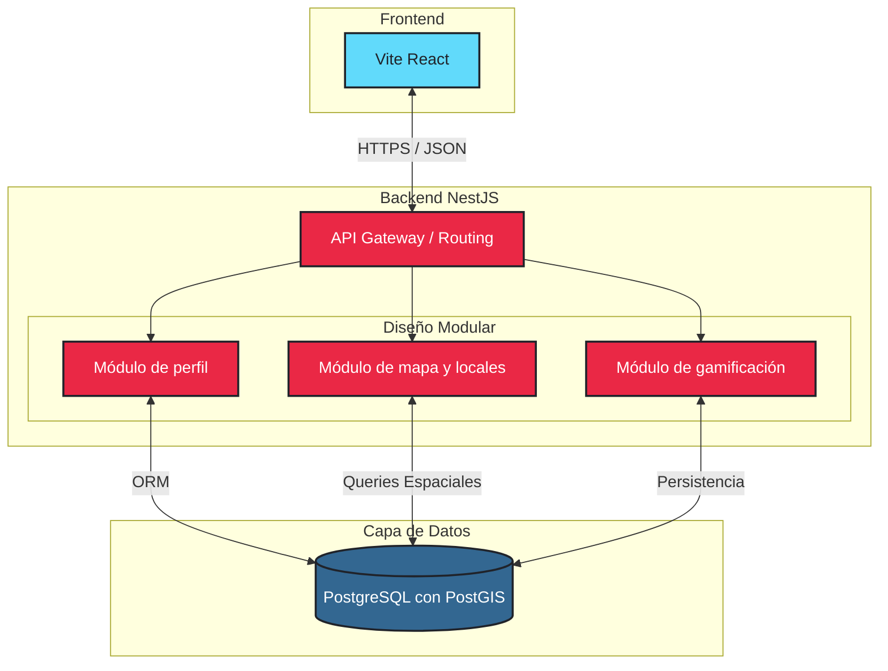

# Impact Analysis – Template

## 1. Cambio solicitado

### Cambio funcional
El módulo del mapa interactivo debe operar con actualización en tiempo real (WebSocket), mientras que el módulo de estadísticas para productores requiere procesamiento batch nocturno con grandes volúmenes de datos históricos.
### Cambio no funcional
El sistema debe escalar el módulo de mapa de forma independiente durante eventos masivos (ej: festival de música), sin afectar la disponibilidad del módulo de gestión de locales.
### Tensión arquitectónica
Una arquitectura monolítica no permite escalar módulos de forma independiente. El mapa en tiempo real y el procesamiento batch tienen requisitos de cómputo tan distintos que coexistir en el mismo proceso genera contención de recursos.

---

## 2. Nuevas historias de usuario

### US-11
como usuario común
quiero poder tener acceso a las alternativas relacionadas a servicios de transportes públicos
para poder tener alternativas frente a mis necesidades para poder llegar a diferentes eventos

criterios de aceptación:
- Dado que cuando estoy en la pestaña de mapa cuando presiono un local la aplicación debe poder obtener las coordenadas del local, entonces puede u no redirigirme a una aplicación externa (véase google maps, apple maps, etc)
- Dado que el dispositivo puede tener el GPS u datos móviles desactivados, cuando intente buscar un evento en la sección de mapas para una re dirección a la dirección, entonces la aplicación debe de mostrar una sección de error

### US-12
Como dueño de local
Quiero poder establecer recompensas a la gente que participe físicamente en el evento
Para poder atraer tanto público objetivo a futuro como clientes en mi local a largo plazo

Criterios de aceptación
- Dado que existe un sistema de gamaficacion en la aplicación, entonces quiero poder elegir si dar puntos dentro de la aplicación o poder dar productos dentro del local u bar (véase bebidas, comida, etc)
- Dado que la aplicación usa ubicación en tiempo real, entonces, quiero que el check in se tenga que hacer con un sistema de QR donde se escaneen a los usuarios que vengan

---

## 3. Impacto en requisitos extrafuncionales

Indicar si el cambio altera la prioridad de algún REF o introduce nuevos.  
Trazar cambios de prioridad que motiven cambios en decisiones de arquitectura.

| REF ID  | Descripción       | Cambio / Motivo | Prioridad anterior | Prioridad nueva |
|---------|-------------------|-----------------|--------------------|-----------------| 
| REF-01  | El mapa debe cargar en menos de 3 segundos | Sin cambio | Alta | Alta |
| REF-02  | La aplicación debe estar disponible el 99.5% del tiempo. El sistema debe recuperarse automáticamente de errores temporales | Sin cambio | Alta | Alta |
| REF-03  | La aplicación debe usarse sin capacitación previa. Debe funcionar correctamente en dispositivos móviles y escritorio | Sin cambio | Alta | Alta |
| REF-04  | El sistema debe soportar hasta 10,000 usuarios concurrentes sin degradación. Permitir migración futura a microservicios | Sin cambio | Alta | Alta |
| REF-05  | Implementar autenticación. Autorización basada en roles. Validar y sanitizar entradas | Sin cambio | Alta | Alta |
| REF-06  | Mantener separación clara entre módulos. Documentar APIs y arquitectura | Sin cambio | Baja | Baja |
| REF-07  | Soporta Chrome, Firefox, Safari, etc. | **Cambio Motivo:** Es necesario que el mapa se soporte en cualquier navegador | Baja | Alta |
| REF-08  | Realizar backups diarios. Implementar logging y alertas | Sin cambio | Baja | Baja |

---

## 4. Impacto en entidades del dominio

En el impacto de entidades al dominio es en relaciones afectadas principalmente, y que al
cambiar de un modelo microservicios "monolitico" a uno de microservicios "distribuidos"
se afectan princpalmente las relaciones entre los microservicios.

La lógica de negocio de cada entidad, validaciones de dominio, contrato de interfaces
y validaciones de dominio. Cambia principalmente los límites de contexto de cada modulo 
se deben re-organizar al realizar la migración.

---

## 5. Impacto en mockups

Los cambios son mínimos, ya que lo que cambia principalmente es el backend. Por lo que el usuario
seguiria viendo lo mismo, solo que por como funciona adentro sería en un sistema de microservicios distruibo
para escalar el rendimiento, sobre todo el módulo de mapa.

El único cambio que se hará, es que en el mapa ahora al hacer click sobre un local. La misma web
te hará un "¿Cómo llegar hasta ese local?" con un camino marcado.

---

## 6. Impacto en arquitectura

### 6.1 ¿Cambia el estilo arquitectónico?

**Sí**, cambia arquitectonicamente, pero no cambia el estilo, ya que seguimos
utilizando microservicios, pero ahora en vez de ser un monolito de microservicios,
pasamos a una arquitectura de microservicios distribuidos.

Esto es porque la REF de mantenibilidad y escabilidad son mayores, ya que se necesita que
los websockets del mapa sean distribuidos para funcionar correctamente.

### 6.2 Relación REF (repriorizado) con decisiones de arquitectura

| REF ID | Prioridad nueva | Decisión de arquitectura que lo aborda |
|--------|-----------------|----------------------------------------|
| REF-07 | Alta            | Mantener microservicios distribuidos.  |
| REF-02 | Alta            | Mantener microservicios distribuidos.  |

---

## 7. Impacto en módulos

| Módulo | Tipo de impacto | Responsabilidad actualizada | Ofrece a otros (actualizado) |
|--------|-----------------|-----------------------------|-----------------------------|
| Mapa | actualización | Gestión de conexiones en tiempo real: Mantener y gestionar múltiples conexiones concurrentes vía WebSockets para emitir actualizaciones instantáneas en el mapa (ej. visualización de alta demanda o inicio de eventos en vivo) | API Geoespacial (REST/gRPC): Endpoints para que otros módulos consulten "qué entidades (locales/usuarios) existen dentro de un radio de X km" |

**Módulos relacionados con Mapa:**

| Módulo relacionado | Tipo de relación | Descripción |
|--------------------|------------------|-------------|
| Gamificación | Comunicación asíncrona | Pasa a ser una comunicación puramente asíncrona. El mapa emite el evento `UsuarioPuntoPunto` mediante el bus de mensajes. Gamificación lo escucha y asigna la experiencia/credibilidad correspondiente sin que el mapa deba esperar la respuesta |
| Perfil | Autenticación y filtrado | Recibe un token o ID de sesión para cruzarlo de manera ágil con filtros de mapa preferidos, priorizando el rendimiento en la entrega de coordenadas |

**Fundamentación de cambios modulares:**

El módulo Mapa se actualiza para soportar múltiples conexiones concurrentes vía WebSockets, lo que es crítico para cumplir con:
- **REF-01 (Rendimiento):** Carga del mapa en menos de 3 segundos
- **REF-04 (Escalabilidad):** Soportar 10,000 usuarios concurrentes sin degradación
- **REF-07 (Interoperabilidad):** Funcionamiento en cualquier navegador moderno

La adopción de comunicación asíncrona con Gamificación desacopla los módulos, mejorando la mantenibilidad y permitiendo escalar cada servicio independientemente. La integración con Perfil optimiza el rendimiento al priorizar el envío de coordenadas con filtros preestablecidos del usuario.

---

## 8. Nuevas decisiones de diseño

### Decisión 1: Cambiar el modelo monolítico a un modelo distribuido (microservicios)

- **Decisión:** Migrar de una arquitectura monolítica modular a una arquitectura de microservicios distribuidos con comunicación asíncrona mediante Event Bus (Kafka/RabbitMQ), cachés distribuidas (Redis) y bases de datos dedicadas por servicio.

- **Motivación:** Aumentar la interoperabilidad entre los módulos del sistema manteniendo la funcionalidad del resto de los módulos. La nueva problematica presentada del websocket requiere que múltiples instancias del servicio de Mapa se comuniquen en tiempo real, sin bloqueos y de forma distribuida.

- **Alternativas consideradas:** 
  - Ninguno de los otros modelos (monolítico simple, arquitectura de capas tradicional, serverless) nos permite resolver la nueva problemática presentada del websocket de forma eficiente y escalable.

- **Impacto:** Afecta transversalmente al modelo arquitectónico de nuestra solución. Sin embargo, el impacto particular sobre cada módulo de la aplicación es mínimo, ya que cada servicio mantiene sus responsabilidades y interfaces expuestas de forma similar a como las tenía en el modelo anterior.

---

## 9. Trazabilidad actualizada

| Historia | REF relacionado     | Módulo       | Mockup    |
|----------|---------------------|--------------|-----------|
| US-11    | interoperabilidad   | mapas        | no afecta |
| US-12    | IDs de los usuarios | gamificación | no afecta |

---

## 10. Justificación global y trade-offs

### Coherencia de la solución propuesta

La solución propuesta es completamente coherente con la aparición del nuevo requisito, al poder asignar a este nuevo requerimiento un módulo propio que asuma la carga y disponibilidad de su función, de manera independiente a los otros módulos que no reciben la misma carga y que no se actualizan en tiempo real.

### Trade-offs asumidos

El nuevo modelo permite mantener escalabilidad y rendimiento a cambio de la mantenibilidad del sistema. La interoperabilidad entre los módulos hace que, al tener un módulo funcionando en tiempo real que se conecta a los otros módulos, dificulta la mantenibilidad de todos los módulos a los que se conecta.

Sin embargo, la mantenibilidad es un aspecto que se mantiene en prioridad baja, dado que los cambios a hacerse son mínimos dentro del sistema.

### Qué se gana y qué se sacrifica

**Qué se gana:**
- Escalabilidad independiente: Cada servicio puede escalarse según su demanda
- Resiliencia mejorada: Fallos aislados no derriban el sistema completo
- Rendimiento optimizado: WebSockets distribuidos con caché reducen tiempos de respuesta
- Flexibilidad operacional: Despliegues independientes y mantenimiento sin downtime

**Qué se sacrifica:**
- Complejidad operacional: Requiere infraestructura distribuida (Kafka, Redis, múltiples BD)
- Mantenibilidad local: Mayor complejidad en debugging y tracing distribuido
- Consistencia inmediata: Comunicación asíncrona introduce eventual consistency
- Overhead de infraestructura: Mayor costo de recursos y complejidad de configuración

#### Chats de IA utilizados
- https://claude.ai/share/e87164ca-3053-4dce-99a8-ccd930b2430a
- https://g.co/gemini/share/0080c0ffb139
- https://g.co/gemini/share/4d63def61c64